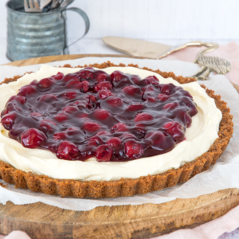

# Monchou Taart

## Benodigdheden
* 1 Pak bastogne koeken
* 100 Gram ongezouten roomboter
* 250 Ml slagroom
* 100 gram suiker
* 8 gram vanillesuiker (Dr. Oetker)
* 200 gram MonChou kleine, stevige pakjes
* 1 portie

### Bereiding

1. Maal de bastogne koeken fijn in een keukenmachine. Smelt de boter in een pannetje en voeg hier de koekkruimels aan toe. Roer goed door tot een stevige massa.
2. Schep het koek-botermengsel in de met bakpapier beklede bakvorm en verspreid het gelijkmatig over de bodem. Zet de bodem in de koelkast.
3. Ondertussen maak je de vulling voor de taart. Klop in een kom de slagroom met 2 eetlepels suiker stijf.
4. In een andere kom meng je de suiker, vanillesuiker en MonChou tot een romig mengsel. Voeg de slagroom toe aan het MonChou mengsel en mix dit er doorheen.
5. Schep de vulling op de afgekoelde taartbodem en zet de taart minstens 2 uur in de koelkast zodat de vulling goed stevig wordt.
6. Als je één blik vlaaivulling gebruikt kun je deze gelijk over de taart verdelen. Gebruik je twee blikken zoals ik heb gedaan? Haal dan alleen de kersen uit het blik met een vork. Overtollig gelei blijft dan in het blik zitten. Zo heb je lekker veel kersen op de taart maar wordt het niet te vol omdat je niet alle gelei gebruikt. Verdeel de kersen gelijkmatig over de taart.

[Bron](https://www.laurasbakery.nl/monchou-taart/)